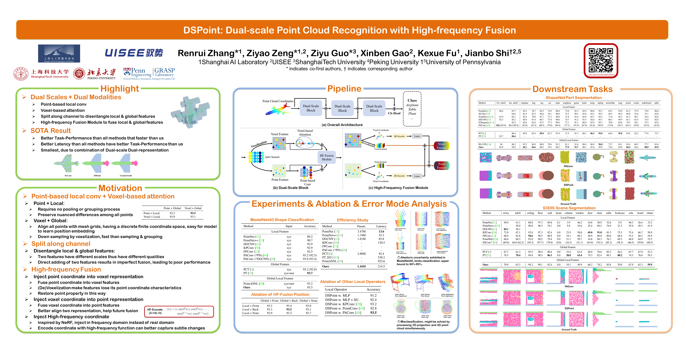

# DSPoint
Official implementation of "DSPoint: Dual-scale Point Cloud Recognition with High-frequency Fusion".

_**Accepted by SMC 2023**_

**Paper link:** https://arxiv.org/abs/2111.10332

**Author:** Renrui Zhang\*, Ziyao Zeng\*, Ziyu Guo\*, Xinben Gao, Kexue Fu, Jianbo Shi

**For Downstream Tasks and Error Mode Analysis**: [Link](https://github.com/Adonis-galaxy/DSPoint/blob/main/downstream%20tasks%20and%20error%20mode.pdf)




## Shape Classification
Shape Classification of [ModelNet-40](https://modelnet.cs.princeton.edu/) are given as an example of our method.

### Preparation

```
cd dspoint
conda create -n dspoint python=3.7
conda activate dspoint
conda install pytorch==1.6.0 torchvision==0.5.0 cudatoolkit=10.1 -c pytorch
pip install -r requirements.txt
pip install pointnet2_ops_lib/.
```

Dataset will be automatically downloaded during training or testing.

### Train

Train your model with our default settings (same as the paper):

``` 
sh train.sh
```

Evaluation will be done during training process.

Since the dataset is quite small (2468 for testing) and training performance on point cloud is quite random, it would be normal if you get model whose test accuracy varies between 93.0-93.5 (amount to 10 test data).

### Test


Evaluate with our pre-trained model (already included in ./checkpoints):
``` 
sh test.sh
```

You should see the test accuracy at 93.48.

## Citation  

If you find this repo useful in your work or research, please cite our paper.

## Acknowledgement

Our code borrows a lot from:
- [PCT](https://github.com/Strawberry-Eat-Mango/PCT_Pytorch)
- [PAConv](https://github.com/CVMI-Lab/PAConv)
- [PVCNN](https://github.com/mit-han-lab/pvcnn)
- [PointNet++](https://github.com/erikwijmans/Pointnet2_PyTorch)
- [NeRF](https://github.com/yenchenlin/nerf-pytorch)

